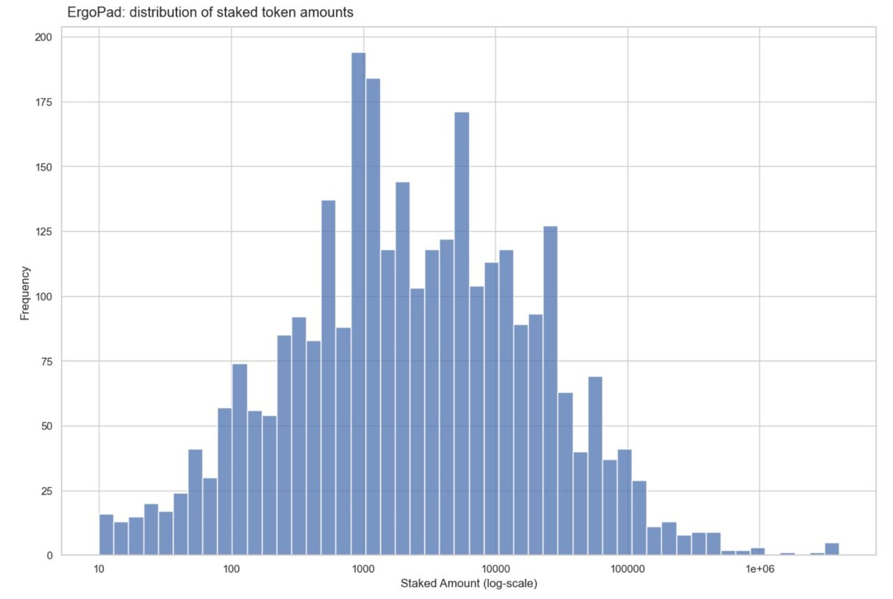

# Azorus: A Blockchain Data Service

## Summary

Azorus is software that makes blockchain data easy to use. Blockchains are lists of transactions, and to be useful, these lists need organization. Azorus structures UTXO blockchain data into a database of relationships. Data in a relational database is easy to sort, analyze and visualize. With cross-chain data, a larger data set will be available that will allow for new uses. Azorus will offer subscriptions to this database through an interactive website and an application programming interface ([API](https://simple.wikipedia.org/wiki/Application_programming_interface)). The team will also charge consulting fees. With time, Azorus aims to grow into an information ecosystem for UTXO blockchains.  

## Introduction to UTXO Blockchains

Azorus is software for accessing information from a type of blockchain called a UTXO blockchain. Bitcoin is the most well-known UTXO blockchain. But, there are others, such as Cardano, Ergo, and other members of [the UTXO alliance](https://utxo-alliance.org/). What does UTXO mean?

UTXO is an abbreviation for “[unspent transaction output](https://en.wikipedia.org/wiki/Unspent_transaction_output).” It is a fancy term for using cryptography to move digital assets from one account to another in a secure way. Practically, a wallet is a good metaphor for understanding how it works. 

If you take $20 from your wallet to pay for a $5 gift card, the person you are paying will give you back $15 dollars and a $5 gift card. The $15 dollars you did not spend and the $5 gift card is the “unspent transaction output” for this transaction. 

A blockchain batch processes each UTXO transaction with other transactions as a block.  Transactions are written to the blockchain as part of a block. A blockchain is simply a series of blocks, chained together, in sequence, over time.

## A Scenario: The NFT Artist

Imagine you are an artist. Instead of gift cards, you sell digital art as non-fungible tokens ([NFTs](https://ergoplatform.org/en/blog/2022-03-08-how-to-minting-a-non-fungible-token-nft-on-the-ergo-blockchain/)) on a blockchain, and your business address has 2,000 transactions per year, most coming from royalties on sales. The blockchain can tell you who your customers are, how many times they purchased an NFT from you, when purchases were made, if they sold the NFT, the price your NFT was sold, your royalty income for the year and so forth. 

It can also tell you other information. It can help you identify other NFTs your customers buy, frequency of trading, what they bought before or after your NFT, and other information that can help you better understand them. 

But, how does someone turn 2,000 transactions into actionable information? For example, if an artist is making NFTs, how do they find out how many wallets own, or have ever owned, one of their NFTs? 

## The Information Gap

For blockchains and their tokens, there is an enormous information gap. The problems of NFT artists are typical. Consider how easy it is to answer these common questions:

* How much tax do I need to pay on my cryptocurrency transactions?
* What was the cost, in some currency, for a digital asset at some time?
* What were my aggregate transaction costs for a year?
* What was my yield for being part of a liquidity pool?

With larger businesses, questions become even more difficult. If one were running a blockchain project like Ergopad and wanted to know how many wallets are staked and at what level in the project, how difficult is it to generate a chart displaying this information?

 

Raw blockchain data needs to be transformed to be useful. The basic requirements are setting-up nodes, running explorer instances, writing code to parse blockchain data into a database, formulating database queries and exporting selected data to use in some way, often as input for another program. 

It is possible to access blockchain information without a database. For example, RStudio is an integrated development environment ([IDE](https://en.wikipedia.org/wiki/Integrated_development_environment)), and a program can be written to import blockchain data using [tidyergo](https://github.com/Eeysirhc/tidyergo) (a library written by a member of the Azorus team), analyze it and create graphs that are more easily understood, like the one above. But, pulling information directly from the Ergo blockchain chain means a lot of work to get the data in a useful form. An API to the Azorus database could eliminate much of that work. 

For most people, getting and interpreting blockchain data is an impossible task. Even for people that can do it, the Azorus database will make the task easier. In many circumstances, the amount of time it saves will be well worth the subscription price. For those with more time than money, Azorus will also make its software available as open source.

## Building Azorus

Azorus will start by setting up Ergo nodes and explorer instances. These will be available to subscribers for a small fee. Then, they will create a database accessible through an interactive web application or an API. A prototype was developed in the May 2022 Ergohack and described in [a video](https://www.youtube.com/watch?v=SD8bDf-nxTQ).

API access to the Azorus database will allow programmers and data analysts to import data into tools that they already use. But, the Azorus API will have more functionality than pulling data directly from the blockchain. The interactive website is useful because it allows anyone to subscribe and query the Azorus database. 

The minimally viable product, a database of Ergo blockchain data, should take nine months to create. It will provide the template that will be used to expand the database to use data from other UTXO blockchains.

Once established, Azorus will add customization options, performance improvements, standard filters and other enhancements. But, the most important feature will be cross-chain data. This will create a new source of data that will make it easier to compare blockchains and dApps, train machine learning and artificial intelligence models, and so on.

Eventually, Azorus will develop an ecosystem for sharing and selling tools, templates, analysis and services. The shape of the ecosystem will depend on the information needs of each blockchain. Demand will shape the market, and it is impossible to say in advance what shape it will take.

This ecosystem could include incentives for decentralized technical infrastructure services, such as nodes, computational capacity, customer platform templates, and so forth. Or, it might turn into a marketplace for research, where people fund projects with smart contracts to get the information they need. More likely, it will grow into something beyond what we can anticipate.

## Conclusion

Azorus will provide the technical infrastructure to easily access blockchain information across several UTXO blockchains. A cross-chain database aimed at data analysts and programmers is the core product, but there is room to extend this product to a general audience and create an information ecosystem. Within such an ecosystem, it will be possible to buy and sell decentralized services, analyst reports and software to extend the capabilities of the core product.

