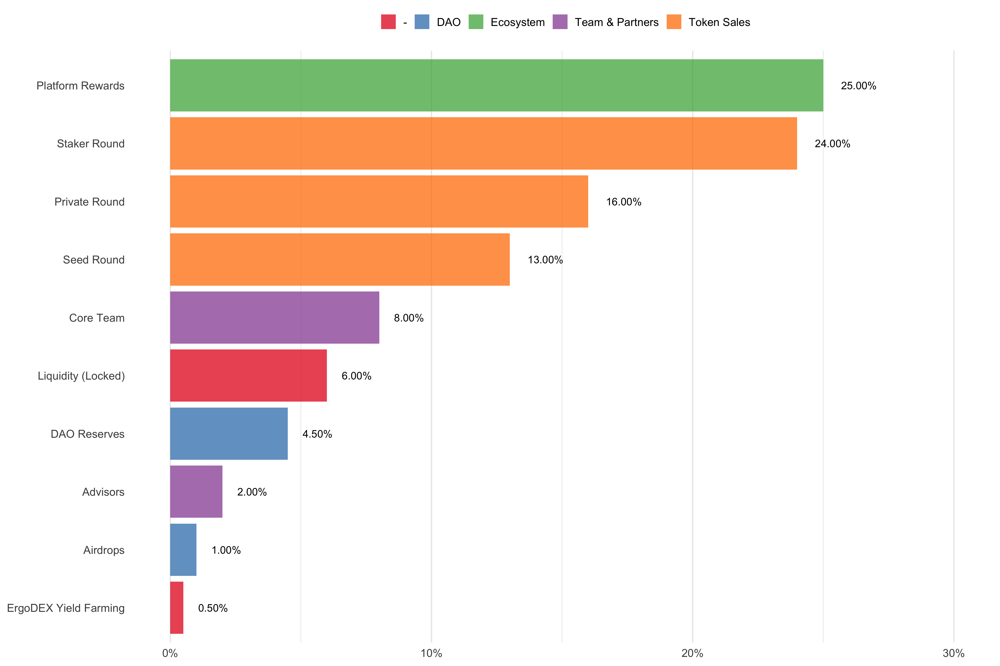
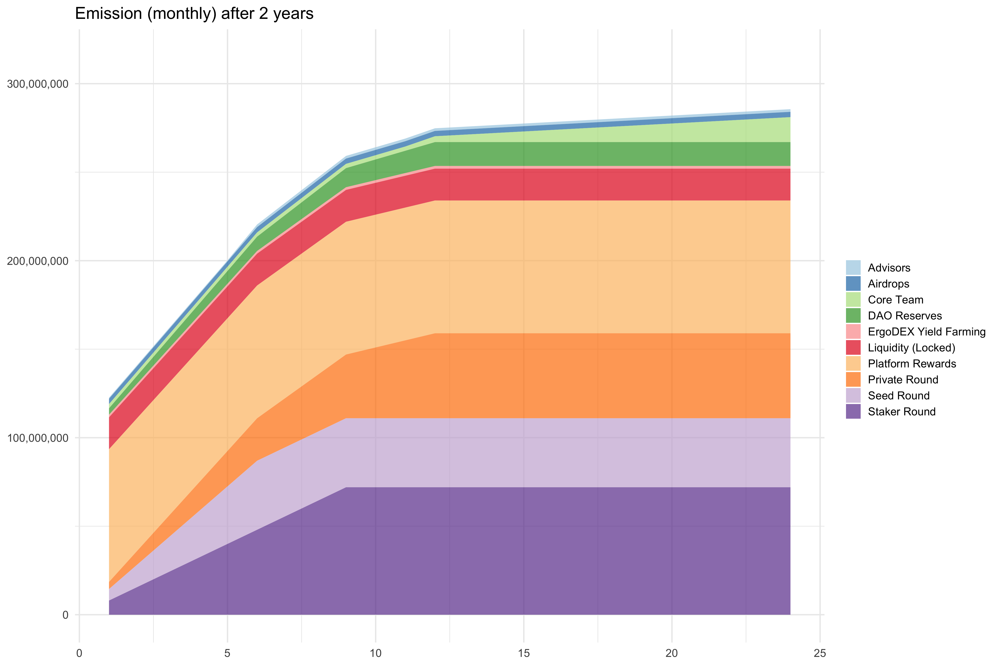

# Azorus Whitepaper

## The UTXO Blockchain Intelligence Platform

Blockchain ledger data is immutable, secure, transparent, and readily available to everyone. 

Accessing this information in its current state, however, requires a large amount of time and material investment just to retrieve even the most basic of ecosystem statistics. For instance, he or she will need to know how to interact with the blockchain, maintain the data pipelines, write code to extract the data, analyze and visualize it to draw insights, then share it with the rest of the world for consumption. These are multiple jobs that a person may not always be willing to accept. Additionally, some users are only interested in providing the data, while others just want to create analysis and reports. 

To solve for this, we intend to build Azorus, a web3 based data intelligence suite for all UTXO blockchains. This data platform allows our core customers to focus specifically on interfacing with blockchain data, decrease their time to visualization, analysis and insights, while also offering the customization and flexibility of using their preferred programming language.

We will first focus our efforts on Ergo, but once the core infrastructure and UI components are cemented in place, we will expand to integrate across all UTXO technologies while also moving towards a fully decentralized service.

## Background

The section below higlights some of the macro trends that are happening at a global scale and underscore the need for a blockchain intelligence platform such as Azorus.

### Big Data

Over the past decade, the world has experienced a parabolic rise in data generation capabilities which has spawned a data analytics industry estimated at $198 billion in 2020[^fn1]. This trend is expected to continue with a projected market size of approximately $235 billion by 2026[^fn2] and $346 billion by 2030[^fn3]. Although it is a fledgling technology, we can extrapolate from this that blockchain ledger data will also play a crucial role for the future of web3 infrastructure. Thus, we can anticipate the growth trajectory and the need for blockchain intelligence to mirror that of the early big data industry.

### Skills Shortage

The dramatic rise in data has outpaced the traditional labor market to produce specialized individuals who can analyze and draw insights from it, primarily data scientists and machine learning practitioners. For example, one study estimated a shortage of 250,000 individuals[^fn4] in 2020 to fulfill data science/analytics related positions. With a +300% YoY increase in demand for blockchain developers[^fn5] in 2019, we can also expect a similar skills shortage for the blockchain data science industry in the coming years.

### Cloud IDE

Programming on a local environment can be daunting for new developers when they are not sure if their machine will be limited by hardware performance. For veterans, it can be frustrating to setup a consistent development environment where correct syncing is required to collaborate with others. With an increasingly distributed workforce since the COVID-19 pandemic, and a worldwide chip shortage that is driving up consumer prices[^fn6], it becomes mission critical for us to ensure anyone can access blockchain data at scale even if they do not have the top of the line hardware, but just a web browser and a stable internet connection. To secure a competitive advantage, future projects will also need to achieve this minimalist yet seamless user experience. 

### UTXO vs Account Model

There has been a lot of literature[^fn7] published[^fn8] on this topic[^fn9] over the years so we will not dive too much into it. With that being said, we believe the UTXO model will be the industry standard to efficiently and securely deploy financial contracts in the future. 

### Ergo

The current market mindset focuses too much on price action and very specific product "features." Ergo, however, is one of the very few cryptocurrencies being developed where individual privacy, security, and decentralization is a first class citizen. Technology will always come and go, but having a vision that galvanizes builders from all over the world to turn this idea into reality is a force to reckon with, and why we intend to first launch on this blockchain. 

> We encourage everyone to read the Ergo Manifesto[^fn10] if they have not already done so.

 

## Market Gaps

### Data Accessibility

We believe individuals and businesses should have an easy time collecting and analyzing blockchain data to make informed decisions. With that being said, there is a lack of flexible and custom onchain analytics software in the industry. This need will become more apparent in the coming years as the field matures and more projects are launched with the UTXO model. 

### Technical Barrier 

There exists a fairly steep learning curve for someone who just wants to retrieve and visualize blockchain data. For example, setting up a node requires some hardware knowlege, but launching it also requires executing software just to get the base layer ready. Successfully completing both components may be out of reach or even beyond the appetite of the average customer. 

### Limited Flexibility

The current tooling in this space achieves what it set out to do - provide data views on broader ecosystem health. However, services like Glassnode on Ethereum are fully centralized. This comes at a cost to data accessibility and creates a central point of failure when the customer just wants a specific view but they need to wait for a product update that may never happen due to competing internal priorities. 

### Custom Visualization

Websites like Dune Analytics is a SQL-based system which means any type of graphical plotting functionality is limited to the frontend libraries they decide to use. Unfortunately, this decision significantly truncates the scope and ability for blockchain analysts to parse data, visualize market trends, extract insights, customize their graphs, and share their analysis. For example, something as simple as flipping the y-axis may require a lengthy code workaround or not even making it a visualization option.

### Audience Interests

Everyone has varying degrees of time, interest, and programming knowledge when it comes to blockchain data. Some enjoy setting up the entire workflow from node launch to report publications, others just want to view charts, yet another segment is only intrigued by developing machine learning models with blockchain data. As it currently stands, there are only a few individuals in the Ergo community who can play all of these parts. Thus, a platform is needed to serve all these varying user interests and accelerate growth outside of our immediate UTXO communities. 

## Product Vision

### Blockchain Science

We believe there is no "correct" data science computing language to retrieve, analyze, and visualize blockchain data. Our goal is to leave that decision up to the user to determine what the right tool is for the job. Thus, Azorus will first launch with in-browser kernels that have SQL, Python, and R capabilties along with popular machine learning and artificial intelligence modules. As the platform grows we will expand our coverage depending on customer demand.

### Enterprise Capabilities

If Azorus intends to handle datastreams that power web3 businesses or become the platform for data scientists to build large scale economic models, we need to easily handle large computational loads. Data stability and reliability will always be a first class citizen to inspire confidence in the platform from not just instituational customers, but also newcomers to the blockchain analytics industry who just want to learn how everything works.

### Feedback Loop

Other blockchains like Ethereum already have a saturated market of analytics tooling vying for attention. By developing Azorus on nascent UTXO technology, we have the advantage of cultivating product feedback very early to address customer issues, opportunity to set the analytics standard, and to move much faster than being in a crowded market. In addition to this, it allows us to invite and foster a collaborative spirit for the next generation of blockchain analysts into the ecosystem. 

### Hybrid Service

The end goal is to have a fully decentralized data infrastructure for all audiences of the platform inclding data providers, computation miners, blockchain analysts, and consumers. We imagine everyone having access to Azorus functionality straight from their Ergo/UTXO node without the need to connect to the Azorus website and preserve their individual privacy. To achieve this though, it is crucial to recognize that a bridge is required to migrate potential customers from the current web2 paradigm and future web3 world. This hybrid approach ensures Azorus offers an experience that web2 users are already familiar with but also move the company toward profitability instead of spinning our wheels waiting for "mass adoption" to happen.

### Platform Ownership

The blockchain analytics business relies on the web2 paradigm of having its creators and customer base share their content with others. This relationship dynamic benefits the service provider only as it offers them subscription revenue, branding, and valuable social signals to further improve their product. All of this is obtained without ever reciprocating anything in return for this skewed interaction. The Azorus team maintains that all design philosophy will adhere to the ideal that everyone should be compensated in some way, shape or form for their contributions.

## Applications

Below is a non-exhaustive sample of how Azorus customers can leverage the platform for their needs whether as an individual or a web2/web3 company.

### Data Feed

Every project can run their own node to retrieve blockchain data as they see fit. But what if it is just an early proof of concept and they want to validate its use case? It may not be worth figuring out how to set all of that up from the start, but instead, invest their time on building the product. Similarly, there might be a blockchain analyst who developed a unique predictive model that pulls in data offchain as well. It may be beneficial for an existing project to integrate this with their services and pay for the API usage.

### Trading Bots

Most, if not all, cryptocurrency trading bots on the market rely on price action to determine if they should initiate a buy or sell order. There might be an opportunity worth exploring to disrupt the space by leveraging onchain data to predict or supplement future price movement. For example, in very broad terms, someone could: create a richlist, identify coin transfers, classify address behavior, then develop a machine learning model on top of the data to extrapolate what could happen next across the market. Being able to unlock this feature would offer the trader a significant advantage in the cryptocurrency exchanges, decentralized or not.

### Portfolio Management

Tracking asset performance is important for getting a read on overall investment health. However, it is just as important to log minute transaction details, especially for customers in particular jurisdictions that have stricter tax laws. This is where accounting software can integrate with Azorus data pipelines to not only warehouse historical data, but also utilize it as the base layer to categorize when an asset or NFT was bought/sold and calculate the profit/loss at the time of the transaction. Using blockchain data would ultimately remove this manual record keeping work for a large number of investors.

### Community Engagement

Querying blockchain data is one way for project owners to interact with ecosystem participants without directly asking them to provide sensitive information like their email or cryptocurrency address. An example of this is with the Mi Goreng memecoin airdrop in March 2022. The token creator, along with the author of this whitepaper and another ErgoDEX mod, queried the blockchain to identify all addresses that ever interacted with ErgoDEX. We then proceeded to airdrop tokens to each one of them which caused quite a stir in the Ergo community[^fn11]. Using this method, the team went on to airdrop a few more rounds picking out different cohorts on the platform: addresses holding 1 or more $ERG, addresses that contributed to a specific liquidity pool, etc. 

### Massive Open Online Course 

The MOOC industry has taken off in the last few years to close the gap in the specialized labor market, specifically for data scientists and machine learning practitioners. For example, the global market value was estimated at $6.85 billion in 2020 and forecasting to $18.93 billion by 2026[^fn12]. The advantage of these programs is that they eliminate the initial technical setup to get the customer development environment running. This means the individual only needs a computer, access to stable internet, and a web browser to participate and acquire a new skillset. 

## Business Model

Azorus intends to recuperate operating expenses and achieve profitability through various revenue streams. 

* *SaaS Subscription:* all reports will be free and open for public consumption and dissemination. For customers who want to keep their anaysis private though, there will be a monthly subscription fee. 
* *API Access:* Azorus will provide a tiered fee structure based on frequency of customer usage.
* *Consulting Services:* there may be instances where individuals or companies need to hire external assistance. The Azorus team can develop custom solutions for these clients or act as a liaison with the community to meet this demand.
* *Platform Fees:* we will partition a percentage of all gated reports and APIs develpoed by customers of the platform.

## Customer Acquisition

The Azorus product marketing strategy divides our total addressable market into four primary cohorts.

To guarantee we build a long-term sustainable acquisition pipeline, we will anchor our efforts on the top and mid funnel customers. By creating evergreen tools and content, we organically nudge potential customers down the marketing funnel. A benefit of this approach is we also increase the lifetime value of the customer as they learn more about other UTXO projects that Azorus will support.

| Funnel | Intent | Effort | Description | Approach | 
| --- | --- | --- | --- | --- | 
| Out | Very Low | Very High | Users with zero interest in blockchain technology, cryptocurrency or anything to do with the UTXO ecosystem. | - | 
| Top | Low | High | Various levels of cryptocurrency investment, typically unaware of the UTXO ecosystem and the benefits the technology provides. | Focus on building open source tools and content outside of the blockchain technology space. Publish and interact specifically with the data science and machine learning communities. Strategic partnerships with web2 organizations. | 
| Mid | Moderate | Moderate | Somewhat familiar with the UTXO alliance but unaware of its unique value propositions. | Create free market intelligence reports with detailed analysis using the Azorus platform. Leverage the various social media channels and active outreach across the cryptocurrency community. | 
| Bottom | High | Low | UTXO brand aware customers, active community members, true champions of the space. | Proactive community outreach within UTXO world. Tips and support for helping share Azorus content, reports, and marketing initiatives. Directly engage with projects building on UTXO platforms. | 

## Roadmap

This is not the final version, but a rough timeline based on engineering estimates at the time of this writing.

| Phase | Category | Description | Timeframe |
| --- | --- | --- | --- | 
| Argus | Foundational Infrastructure | Focused on platform security, initial data pipelines, and getting multiple nodes operational | 2 months |
| Theseus | MVP Launch | Provide kernel notebooks, report creation & sharing, dashboards, and user access layers | 6 months | 
| Orpheus | Reporting & Analytics | Full platform customization, API endpoint development, and custom services for enterprises | 4 months | 
| Asterion | Web3 Integration | Develop Dapp connection for user login, passive income, profit sharing (if applicable) | 3 months | 
| Heracles | Road to Decentralization | Begin the process of decentralizing services from Data Providers to Computation Miners and even Blockchain Analyst workflows | 9 months | 
| Coronus | X-Chain Coverage | Merge with UTXO blockchains depending on the maturity of their data infrastructure | 6+ months |

### Backlog

* Layer 2 data storage and hosting 
* Decentralized computation with Useful Proof of Work (UPoW)
* Oracle Pools (Delphi) integration to supplement with offchain data

## [WIP] Tokenomics

We have listed a few notable callouts below regarding the design of the Azorus token.

* Azorus will launch on the Ergo blockchain and emit a fixed-supply of 300M tokens over the course of 4 years. 
* The core Azorus team will have a 2 year vesting schedule with a 90 day cliff. 
* Early investors, on the other hand, will have all their tokens vested daily within the first year depending on their contribution tier.

### [WIP] Distribution

### [WIP] Emission

### [WIP] Utility 

Every participant of the Azorus blockchain intelligence platform will serve their own purposes and incentives for purchasing the token.

| Audience | Purpose | Incentives | 
| --- | --- | --- | 
| Data Provider | Encourage decentralization by setting up a full node and providing valid, reliable, and processed blockchain data for the Azorus platform  | Earn platform fees | 
| Computation Miner | Lend data processing resources (UPoW) to assist with the development of ML/AI models | Earn platform fees | 
| Blockchain Analyst | Develop reports, charts, machine learning models, and APIs from onchain & offchain data | Passive income through tips, API usage, and gated content | 
| General Consumer | Find answers to their questions and share data insights with others | Utilize and enjoy the benefits of the platform | 
| Enterprise Companies | Large institutions or web3 companies that need to build services on top of various data pipelines | Utilize and enjoy the benefits of the platform | 
| Investor | Speculate on the future value of the platform | Appreciate the financial impact of the token over time |

## Team Composition

### CEO: Chris Yee

Chris (CurbsideProphet) is an active member of the Ergo community with contributions across many projects which include but are not limited to: {tidyergo}[^fn13], the 15 days of Ergo seed phrases[^fn14], the Enigma NFT series[^fn15], the ErgoDEX pricing app[^fn16], r/ergonauts[^fn17].

### CTO: Nicholas Gadacz

Nicholas is the founder and CEO of FTOptimize[^fn18], a full service SEM agency and tech company rolled into one. His career has been focused on building scalable product solutions from the ground up.

### Lead Developer: Walter Bodwell

Walter is the founder of Planigle[^fn19], a company which provides consulting, training and tools to help teams get the most out of agile development. While at Planigle, Walter has worked with companies from start ups to large enterprises to assist them in their software practices. He has also developed an agile project management tool to help teams manage their backlogs, their iterations and their releases.

## Disclaimer 

As of the date of publication, this document does not constitue advice nor a recommendation by the Azorus team, its officers, directors, managers, employees, agents, advisors, or consultants, or any other persson to any recipient of this document on the merits of purchasing, otherwise acquiring, or holding Azorus Tokens or any other cryptocurrency or token. The purchase and holding of cryptocurrencies and tokens carries substantial risks and may involve special risks that could lead to a loss of all or a substantial portion of any money invested. Do not purchase tokens unless you are prepared to lose the entire amount allocated to the purchase. Azorus Tokens, if and when they are created and made available, should not be acquired for speculative or investment purposes with the expectation of making a profit or immediate re-sale. They should be acquired only if you fully understand the intended functionality of the Azorus Tokens, and you intend to use the Azorus Tokens for those purposes only, and it is legal for you to do so. No promises of future utility or performance or value are or will be made with respect to Azorus Tokens, including no promise any Azorus networks will be launched, no promise of inherent value, no promise of any payments, and no guarantee that Azorus Tokens will hold any particular value. Azorus Tokens are not designed and will not be structured or sold as securities. Azorus Tokens will hold no rights and confer no interests in the eqeuity of the Azorus business or any future Azorus platform.

This whitepaper is not a prospectus or disclosure document and is not an offer to sell, nor the solicitation of any offer to buy any investment or financial instrument or other product in any jurisdiction and should not be treated or relied upon as one. Any distribution of this whitepaper must be of the complete documeent including the cover page and this disclaimer and the accompanying boilerplate in their entirety. All information in this document that is forward looking is speculaitve in nature and may change in response to numerous outside forces, including technological innovations, regulatory factors, and/or currency fluctutations, including but not limited to the market value of cryptocurrencies.

This whitepaper is for information purposes only and will be subject to chnage. The Azorus team cannot guarantee the accuracy of the statements made or conclusions reached in this whitepaper. The Azorus team does not make and expressly disclaims all representations and warranties (whether express or implied by statute or otherwise) whatsoever, including but not limited to: any representations or warranties relating to merchantability, fitness for a particular purpose, suitability, wage, title or non-infringement; that the contents of this document are accurate and free from any errors; and that such contents do not infringe any third party rights.

The Azorus team and operators shall have no liability for damages of any kind arising out of the use, reference to or reliance on the contents of this whitepaper, even if advised of the possibility of such damages arising. The Azorus team believes that the informataion reproduced in this whitepaper is accurate and that the estimates and assumptions contained herein are reasonable. However, there are no assurances as to the accuracy or completeness of any included information.

No regulatory authority has examined or approved any of the information set out in this whitepaper. The publication, distribution or dissemination of this whitepaper does not imply compliance with applicable laws or regulatory requirements.

  
 
 
 
 

[^fn1]: Big Data and Business Analytics Market Statistics - 2030. September 2021. https://www.alliedmarketresearch.com/big-data-and-business-analytics-market
[^fn2]: Global Big Data Market to Reach $234.6 Billion by 2026. June 2021. https://www.prnewswire.com/news-releases/global-big-data-market-to-reach-234-6-billion-by-2026--301322252.html
[^fn3]: Data Analytics Market Size, Share, Trends and Forecast 2030. November 2020. https://www.marketresearchfuture.com/reports/data-analytics-market-1689
[^fn4]: The Data Scientist Shortage in 2020. April 2020. https://quanthub.com/data-scientist-shortage-2020/
[^fn5]: The Rise of Bitcoin & Blockchain: A Growing Demand for Talent. October 2018. https://www.glassdoor.com/research/rise-in-bitcoin-jobs/
[^fn6]: Chip shortage will lead to higher PC prices as Dell, HP, and Lenovo pass on higher costs. May 2021. https://www.zdnet.com/article/chip-shortage-will-lead-to-higher-pc-prices-as-dell-hp-lenovo-pass-on-higher-costs/
[^fn7]: Building Ergo: UTXO vs Account. March 2020. https://ergoplatform.org/en/blog/2020_03_03_building_utxo/
[^fn8]: UTXO vs Account-Based Chains. January 2022. https://academy.glassnode.com/concepts/utxo
[^fn9]: Comparing Bitcoin & Ethereum: UTXO vs Account Based Transaction Models. July 2018. https://blockonomi.com/utxo-vs-account-based-transaction-models/
[^fn10]: The Ergo Manifesto. April 2021. https://ergoplatform.org/en/blog/2021-04-26-the-ergo-manifesto/
[^fn11]: Reddit: Out of nowhere I got 2000 Mi Goreng token in my Nautilus wallet. March 2022. https://www.reddit.com/r/ergonauts/comments/tg8t93/out_of_nowhere_i_got_2000_mi_goreng_token_in_my/
[^fn12]: Massive Open Online Course (MOOC) Market - Growth, Trends, COVID-19 Impact, and Forecasts (2022 - 2027). June 2020. https://www.mordorintelligence.com/industry-reports/massive-open-online-course-mooc-market
[^fn13]: {tidyergo}: Ergo blockchain statistics with R/Tidyverse. March 2022. https://github.com/Eeysirhc/tidyergo
[^fn14]: The 15 Days of $ERGO Seed Phrases. February 2022. https://www.reddit.com/r/ergonauts/comments/t2n8yj/the_15_days_of_ergo_seed_phrases/
[^fn15]: Enigma. April 2022. https://www.enigmanauts.com/
[^fn16]: ErgoDEX: token prices. January 2022. https://share.streamlit.io/eeysirhc/ergodex-price-app/main
[^fn17]: Reddit: User Posts. December 2021. https://www.reddit.com/user/monkey_has_pneumonia/posts/
[^fn18]: FT Optimize. January 2016. https://www.ftoptimize.com/
[^fn19]: Planigle. January 2010. https://www.planigle.com/

